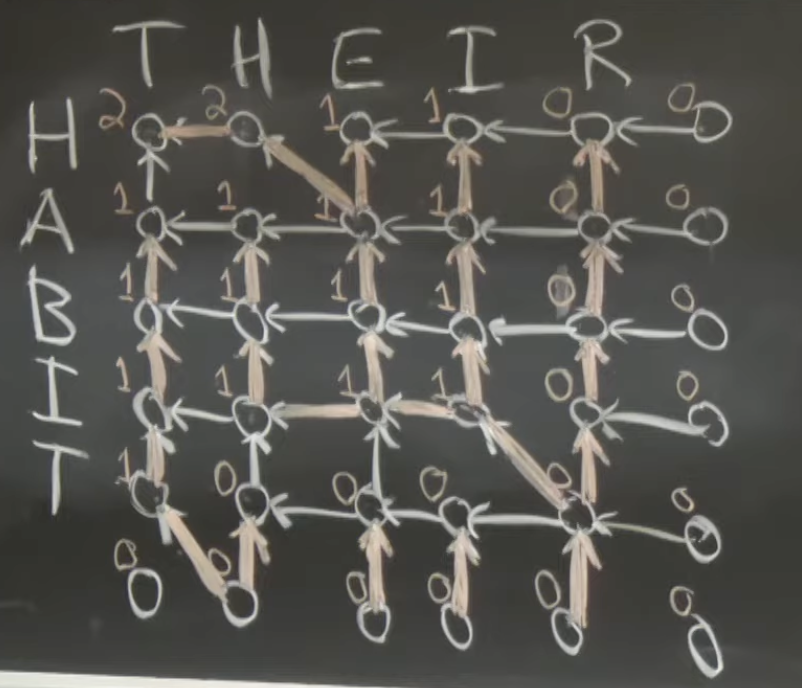
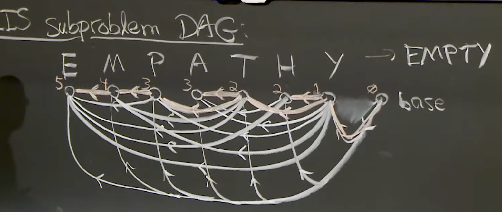

## Dynamic Programming I  

Content:

- SRTBOT 

- Sub-problems
  - for seq $S$, try prefixes $S[:i]$, suffix $S[i:]$, substring $S[i:j]$
  - add subprobs & constraints to "remember state"
- Relations
  - identify question about subprobs solution that if you know the answer: reduces to smaller subprobs
  - Locally brute force all answers to question
  - can think of correctly "guessing" answer, then loop
- Topo order
- Base cases
- Original problem
- Time analysis


### Fibonacci Numbers

Fibonacci numbers: given $n$, compute $F_n = F_{n-1} + F_{n-2}$, $F_1=F_2=1$

- Sub-problems: $F(i) = F_i, 1\le i\le n$
- Relate: $F(i) = F(i-1) + F(i-2)$
- Topo order: increasing $i$ for $1\le i\le n$
- Base cases: $F(1)=F(2)=1$
- Original problem: $F(n)$
- Time: $T(n) = T(n-1) + T(n-2) + 1 \quad (\text{1 more add}) > F_n \approx \phi^{n}$

Time $\le  \sum_{\text{subprob}} \text{relate non-recursive work}$

**Big IDEA: Memorization**

Remember and Reuse solutions to sub-problems

- maintain dictionary mapping sub-problem $\rightarrow$ solution
- recursive function returns **stored solution** if sub-problem seen before, or if doesn't, compute solution and store it

Recursion Tree:

``` bash
1            F(n)
1        /          \
2   F(n-1)        F(n-2)
2   /  \          /   \
3 F(n-2) F(n-3) F(n-3) F(n-4)
...
```

可以发现第3层的 $F(n-2)$ 被计算了两次，$F(n-3)$ 也被计算了两次，这样可以引入 Reuse的概念来避免重复计算。


所以这样只需要计算 $F(1), F(2), \ldots, F(n)$ 每个只计算一次，总共 $O(n)$ 时间。

``` python
def f(subprob):
  if subprob in memo:
    return memo[subprob]
  else:
    # compute solution
    memo[subprob] = solution via relate and recursive calls
    return solution
```

这个就类似于一个DFS的过程。

### DAG shortest paths

Given DAG $G$ and vertex $s$, compute $\delta(s, v)$ for all $v \in V$:

- Sub-problems: $\delta(s, v)$ for all $v \in V$ $\leftarrow $ $|V|$ sub-problems
- Relate: $\delta(s, v) = \min_{(u,v) \in E} \{ \delta(s, u) + w(u,v) | u \in Adj(v)\} \cup \{ \infty \}$
  - $Adj(v)$ 是到 $v$ 的所有前驱节点集合
  - $w(u,v)$ 是边 $(u,v)$ 的权重
- Topo order: topo order of $G$
  - 可以通过 DFS 获得
- Base cases: $\delta(s,s) = 0$
- Original problem: all sub-problems
- Time: $\sum_{v \in V}O(1 + |Adj(v)|) = O(V + E)$


### Bowling

Given $n$ pins in a line $0, 1, \ldots , n-1$, each with value $v_i$. 你可以选择击倒一些相邻的球瓶，得到这些球瓶的价值和作为分数。求最大分数(可以扔0个球)。

两种选择：

- hit 1 pin $i$, get $v_i$ points
- hit 2 adjacent pins $i, i+1$, get $v_i \cdot  v_{i+1}$ points

DP过程：

- Sub-problems: $B(i)=$ max score possible with pins $i, i+1, \ldots , n-1$
  - $\Theta(n)$
- Original problem: $B(0)$
- Relate: $B(i) = \max( B(i + 1), v_i + B(i+1), v_i \cdot v_{i+1} + B(i+2) )$ 因为是 suffix，所以直接考虑 $i$ 位置的选择 
  - Contant Time: $\Theta(1)$
- Topo order: decreasing $i$ for $i \text{ in } n-1, \ldots 0$
- Base cases: $B(n) = 0$, $B(n+1) = 0$
- Time: $\sum_{\text{subprob}} \text{relate non-recursive work} = \Theta(n) \cdot \Theta(1) = \Theta(n)$

DP $\approx$ Local Brute Force

用一种 Bottom-Up 的方式来写代码：

``` python
base: B(n) = 0
      B(n+1) = 0

topo: for i in range(n-1, -1, -1):
         B(i) = max( B(i + 1), v[i] + B(i+1), v[i] * v[i+1] + B(i+2) )
Original: return B(0)
``` 

### Sub-problem Design

Tricks: if input=sequence $x$:

good subproblems are:

- prefixes $x[0..i]$: $\Theta(n)$
- suffixes $x[i..n-1]$: $\Theta(n)$
- substrings $x[i..j]$: $\Theta(n^{2})$

## Dynamic Programming II.

### Longest Common Subsequence (LCS)

(Edit distance related)

Example:

```
HIEROGLYPHOLOGY
vs. 
MICHAELANGELO
```

Longest common subsequence is `HELLO`

Given two sequences $A$ & $B$, find the longest sequence $L$ that's a subsequence of both $A$ & $B$.

Subprobs for multiple inputs: multiply subprob spaces $\times $

对于这个题：两个输入 $A$ 和 $B$，各有3种选择(prefix, suffix, substring)，如果两个都选择 suffix，子问题就将是 **所有的后缀pairs(组合)**：

一个常用的trick: suffix 就看开头的 letter，prefix 就看结尾的 letter。

- Sub-problems: `L(i, j) = LCS(A[i:], B[j:])` for `0 <= i <= len(A)`, `0 <= j <= len(B)`
  - $\Theta(len(A) \cdot len(B))$
- Relate:
  $$
  L(i, j) = \begin{cases} 1 + L(i + 1, j + 1), & \text{if } A[i] = B[j] \\ \max(L(i + 1, j), L(i, j + 1)), & \text{otherwise} \end{cases}
  $$

  解释：这里的intuition就是 如果 $A[i] \neq B[j]$，那么 one of them $\notin$ LCS，所以分别考虑 $A[i]$ 不在LCS ($L(i + 1, j)$)和 $B[j]$ 不在LCS ($L(i, j+1)$)的两种情况，取max，一种暴力的思维。

  接着，如果 $A[i] = B[j]$，那么这个字符基本一定在LCS里，所以 LCS 长度 +1，然后继续看后面的（因为两个序列pair情况一定是非交叉的配对，所以可以直接考虑当前 +1）

- Topo order: decreasing `i` for `i` in `len(A)..0`, decreasing `j` for `j` in `len(B)..0`
- Base cases: `L(len(A), j) = 0` for `0 <= j <= len(B)`, `L(i, len(B)) = 0` for `0 <= i <= len(A)`
- Original problem: `L(0, 0)`
- Time: $\Theta(len(A) \cdot len(B))$ subprobs, each $\Theta(1)$ relate work: $\Theta(len(A) \cdot len(B))$

这种题如果拓展到 `n` 个序列的话，时间复杂度就是 $\Theta(\prod_{k=1}^{n} len(S_k))$，指数级别的时间复杂度。

同时可以用 parent pointers 来记录 LCS 中的每个 字符是从哪里来的，从而可以 reconstruct 出 LCS。

从 `L(i+1,j+1)` 或者 `L(i+1,j)` 或者 `L(i,j+1)` 指向 `L(i,j)`。

### Longest Increasing Subsequence (LIS)

Given one sequence: $A$, find the longest subsequence $L$ such that $L$ is strictly increasing.

Example:

```
CAEBOHYDRATE -> ABORT
```

这种题的 sub-problems 设计比较特殊：

- Sub-problems: `L(i) = LIS(A[i:])` **constraint:** starting at `A[i]` for `0 <= i < len(A)`
  - 非标准的 sub-problems
- Relate
  - $$
  L(i) = \max \begin{cases} 1 + L(j), & \text{for } j > i \text{ and } A[j] > A[i] \\ 1, & \text{if no such } j \end{cases}
    $$
- Original problem: `max(L(i))` for `0 <= i < len(A)`
- Topo order: decreasing `i` for `i` in `len(A)..0`
- Base cases: `L(len(A)) = 0`
- Time: $\Theta(len(A))$ subprobs, each $\Theta(len(A))$ non recursive work: $\Theta(len(A)^{2})$

LCS 和 LIS 其实都可以用 DAG(单源最短路径)来看：

比如 LCS：



构建出这个图，找到Base到终点的最短路径：所有对角线 weights 都设为-1，其他边 weights 设为0。

LIS:



LIS的DAG 也是把 边的 weights 设为 -1，然后找到单源最短路径。

### Alternating coin game 

Given sequence of $n$ coins of value $v_0, \ldots , v_{n-1}$, two players take turns choosing either the leftmost or rightmost coin. 最后 谁的分数更高谁赢。假设两个玩家都很聪明，问第一个玩家(Player 1)能得到的最大分数是多少？

比如说：

```
Coins: 5 10 100 25
```

第一步，player 1 可以选择 5 或者 25:

- 如果选择 5, 剩下 10 100 25，player 2 可以选择 10 或者 25
  - player 2 如果选择 10, 剩下 100 25，player 1 可以选择 100 或者 25
  - player 2 如果选择 25, 剩下 10 100，player 1 可以选择 10 或者 100
- 如果选择 25, 剩下 5 10 100，player 2 可以选择 5 或者 100
  - player 2 如果选择 5, 剩下 10 100，player 1 可以选择 10 或者 100
  - player 2 如果选择 100, player 2 赢了

解法：

- Subprobs:(substrings) $X(i, j)$ = $max$ score player 1 can achieve from coins $v_i, \ldots , v_j$
  - 一种更标准的设计：$X(i, j, p)$ = $max$ score player $p$ can achieve from coins $v_i, \ldots , v_j$, $p \in \{1, 2\}$ 
- Relate:
  - $$
    \begin{cases} X(i, j, 1) = \max \{ X(i + 1, j, 2) + v_i, X(i, j-1, 2) + v_j \} \\ X(i,j,2) = \min \{ X(i+1, j, 1), X(i, j-1, 1) \}  \end{cases}
    $$
   
    解释：Player 1 走的时候只能控制他看到的棋盘，所以他第一步可以选 $v_i$ 或者 $v_j$，式子暂时写成：$\max \{ v_i + K(i+1, j), v_j + K(i, j-1) \}$，用 $K$ 来暂时指代 Player 1 走完之后的棋盘范围。此时假设 Player 2和Player 1一样聪明，那就可以得到 $K(i+1, j)$ 这个值一定是 $\min \{ X(i + 2, j, 1), X(i+1, j-1, 1 )  \}$，第一个值是 Player 2 选 $v_{i+1}$ 的情况，第二个值是 Player 2 选 $v_j$ 的情况。

    没有 $p$ 的话，就是：

    $$
    X(i, j) = \max \{ \min \{ X(i + 1, j-1), X(i+2, j) \} + v_i , \min \{ X(i, j -2), X(i + 1, j-1) \} + v_j\}
    $$
    
    上面引入了一个 $p$，就相当于直接把 Player 2给拆出来 $\min$

- Topo: increasing length $l = j - i + 1$ for $l$ in $1..n$, increasing $i$ for $i$ in $0..n-l$, $j = i + l - 1$
- Base cases: $X(i, i, 1) = v_i$, $X(i, i, 2) = 0$ for $0 <= i < n$
- Original problem: $X(0, n-1, 1)$
- Time: $\Theta(n^{2})$ subprobs, each $\Theta(1)$ non-recursive work: $\Theta(n^{2})$


Subproblems expansion

**一个Trick:** 要计算最长路径，就把 边的 weights 设为 -value，然后找最短路径。

## Dynamic Programming III 

### SSSP in DAG 

- Subprobs: $\delta(s, v)$ for all $v \in V$ $\leftarrow $ $|V|$ sub-problems
- Relate: $\delta(s, v) = \min_{(u,v) \in E} \{ \delta(s, u) + w(u,v) | \underbrace{u \in Adj(v)}_{\text{Guessing}}\} $
  - $Adj(v)$ 是到 $v$ 的所有前驱节点集合
  - $w(u,v)$ 是边 $(u,v)$ 的权重
  - guessing "last edge" $(u, v)$ on shortest $s \to v$ path
- Topo order: topo order of $G$
  - 可以通过 DFS 获得
- Base cases: $\delta(s,s) = 0$
- Original problem: all sub-problems
- Time: $\sum_{v \in V}O(1 + |Adj(v)|) = O(V + E)$

### SSSP(Single-Source Shortest Path) in general graphs(Bellman-Ford)

- Subprobs: $\delta_k(s, v)=$ weight of shortest $s \rightarrow v$ path using $\le k$ edges(for $v \in V$ & $0\le k \le |V|$)
  - 实际上这个 subprobs 设计是对原始的subprobs 做一个限制：因为我们想要的是一个点到另一个点的最短路径，但是原始问题很难，所以设计 at most $k$ edges, 变成一个 更小的 subprobs
- Relate:
  - $\delta_k(s, v) = \min \{ \delta_{k-1}(s, u) + w(u, v) | u \in Adj(v) \} \cup \{ \delta_{k-1}(s, u) \}$
  - 后面的 $\delta_{k-1}(s, u)$ 是为了处理 "no edge added" 的情况
- Topo order: increasing $k$ for $k$ in $0..|V|$
- Base cases: $\delta_0(s, s) = 0$, $\delta_0(s, v) = \infty$ for $v \neq s$
- Original problem: $\delta_{|V|-1}(s, v)$ for $v \in V$; $\delta_{|V|}(s, v)$ for neg-weight cycle detection
- Time: $\sum_{k=0}^{|V|} \underbrace{\sum_{v \in V}O(|Adj(v)|)}_{|E|}  = O(V \cdot E)$

### APSP(All-Pairs Shortest Path) 

使用上面的方法：

- Subprobs: $\delta_k(u, v)=$ weight of shortest $u \rightarrow v$ path using $\le k$ edges for $u, v \in V$ & $0 \le k \le |V|$
- 时间复杂度：$O(|V|^{2} \cdot |E|) = O(|V|^{4}) $(对于 稠密图)

**Floyd-Warshall**(把 $O(|V|^{4}) \to O(|V|^{3})$)

- number vertices: $V = \{1, 2, \ldots , |V|\}$
- Subprobs: $d(u, v, k)=$ weight of shortest $u \rightarrow v$ path **using only intermediate vertices from $\{1, 2, \ldots , k\}$**(constraint) for $u, v \in V$ & $0 \le k \le |V|$
  - 这个 subprobs 设计的 trick 就是 把 "at most k edges" 换成 "only intermediate vertices from {1, 2, ..., k}"，这样就可以把 subprobs 数量变成 $O(|V|^{3})$
- Relate:
  - $$
    d(u, v, k) = \min \{ \underbrace{d(u, v, k-1)}_{k \notin SP}, \underbrace{d(u, k, k-1) + d(k, v, k-1)}_{k \in SP} \}
    $$
  - $O(1)$ non-recursive work
- Topo order: increasing $k$ for $k$ in $0..|V|$
- Base cases: 
  - $$
    d(u, v, 0) = \begin{cases} 0, & u = v \\ w(u, v), & (u, v) \in E \\ \infty, & \text{otherwise} \end{cases}
    $$
- Original problem: $d(u, v, |V|)$ for $u, v \in V$ assuming no neg-weight cycles
- Time: $O(|V|^{3}) \cdot O(1) = O(|V|^{3})$ (仍然针对稠密图)

### Arithmetic Parenthesization

Given a formula $a_0 *_{1} a_1 *_{2} a_2 \cdots *_{n-1} a_{n-1}$, where each $a_i \in \mathbb{Z}, *_{i} \in \{ +, \times  \}$: place parentheses to maximize value of formula.

比如说 `7 + 4 * 3 + 5` 最大化结果是 `(7 + 4) * (3 + 5) = 88`

#### Solution

想到用树

## Practice problems

Template:

- S - Sub-problems
- R - Relate
- T - Topo order
- B - Base cases
- O - Original problem
- T - Time analysis

### Leetcode-139 Word Break

给定一个 string `s` 和 一个 list of strings `wordDict`，判断 `s` 是否可以被拆分成一个或多个在 `wordDict` 中的单词。

**Example:**

```
Input: s = "leetcode", wordDict = ["leet", "code"]
Output: true
Explanation: Return true because "leetcode" can be segmented as "leet code".
```

这个题属于标准DP，直接用上面的SRTBOT框架做分析：

- Sub-problems: `DP(i) = True/False` 表示 `s[0..i-1]` 即 `s[:i]` 是否可以被拆分成在 `wordDict` 中的单词
  - 标准的 sub-problems: 用 prefix 表示子问题
- Original problem: `DP(len(s))`
- Relate:
  - `s[:i]` 在 `wordDict` 中 $\Rightarrow DP(i) = True$
  - 否则，枚举 `j` 使得 `0 <= j < i`，如果 `DP(j) == True` 且 `s[j:i]` 在 `wordDict` 中，则 `DP(i) = True`
  - 否则 `DP(i) = False`
- Topo order: increasing `i` for `i` in `1..len(s)`
- Base cases: `DP(0) = True` (空字符串可以被拆分，但是题中说 `wordDict` 中的单词不为空，所以不会影响结果)
- Time: $O(n^2)$, $n$ 是 `s` 的长度。这个题 `1 <= s.length <= 300`，所以 $O(n^2)$ 是可以接受的。`m = wordDict.length <= 1000`，所以如果用 $O(m\cdot n)$ 的算法，其实不如 $O(n^2)$。


### Leetcode-322 Coin Change

给定一个 integer array `coins` 表示不同面值的硬币，和一个整数 `amount` 表示总金额。计算凑成总金额所需的最少硬币数量。如果无法凑成总金额，返回 `-1`。

**Example:**

```
Input: coins = [1,2,5], amount = 11
Output: 3
Explanation: 11 = 5 + 5 + 1
```

这个题的**难点**在于状态转移方程其实是倒着往回想的：

一开始我想套用139题的状态转移方程：找出 `min_num = min(coins)`，然后遍历 `i in range(min_num, amount + 1)`，在循环里枚举 `j` 使得 `0 <= j < i`，如果 `DP(j) == True` 且 `s[j:i]` 在 `wordDict` 中，则 `DP(i) = True`。或者 `i in coins`，则 `DP(i) = True`。

但是这样的时间复杂度是 $O(n^2)$，会超时。这个题 $n$ 比较大，`1 <= amount <= 10^4`。

所以这个题的状态转移方程其实是不要枚举 `j`，而是直接枚举每个硬币 `c` in `coins`，如果 `i - c >= 0`，则 `DP(i) = min(DP(i), DP(i - c) + 1)`。

- Sub-problems: `DP(i) = x` 表示凑成金额 `i` 所需的最少硬币数量为 `x`
  - 标准的 sub-problems: 用 amount 表示子问题
- Original problem: `DP(amount)`
- Relate:
  - 枚举每个硬币 `c` in `coins`，如果 `i - c >= 0`，则 `DP(i) = min(DP(i), DP(i - c) + 1)`
- Topo order: increasing `i` for `i` in `1..amount`
- Base cases: `DP(0) = 0`, `DP(i) = inf` for `i` in `1..amount`
- Time: $O(n \cdot m)$，其中 `n` 是 `amount`，`m` 是 `coins` 的长度。`n <= 10^4`，`m <= 12`，所以这个时间复杂度是可以接受的。


### Leetcode-300 Longest Increasing Subsequence

给定一个整数数组 `nums`，找到其中最长严格递增子序列(strictly increasing subsequence)的长度。

**Example:**

```
Input: nums = [10,9,2,5,3,7,101,18]
Output: 4
Explanation: The longest increasing subsequence is [2,3,7,101], therefore the length is 4.
```

这个题的关键点在于 sub-problems 的设计：

之前遇到的所有输入为 sequence 的 DP 题，sub-problems 都是用 prefix 或 suffix 来表示的。

这个题如果继续用 prefix 来表示 sub-problems 的话，状态转移方程特别难找，因为 prefix 里最后一个元素不一定是 LIS 的最后一个元素。

所以这个题的 sub-problems 设计成 `DP(i) = x` 表示以 `nums[i]` 结尾的 LIS 的长度为 `x`。

所以，SRTBOT 分析如下：

- Sub-problems: `DP(i) = x` 表示以 `nums[i]` 结尾的 LIS 的长度为 `x`
  - 非标准的 sub-problems：新增条件
- Original problem: `max(DP(i))` for `i` in `0..len(nums)-1`
- Relate:
  -  枚举 `j` 使得 `0 <= j < i`，如果 `nums[j] < nums[i]`，则 `DP(i) = max(DP(i), DP(j) + 1)`
-  Topo order: increasing `i` for `i` in `0..len(nums)-1`
- Base cases: `DP(i) = 1` for `i` in `0..len(nums)-1`
- Time: $O(n^2)$，`n` 是 `nums` 的长度。 `nums.length <= 2500`，所以 $O(n^2)$ 是可以接受的。

### Sunny Studies

Tim the Beaver needs to study for exams, but it's getting warmer, and Tim wants to spend more time outside. Tim enjoys being outside more when the weather is warmer: specifically, if the temperature outside is $t$ integer units above zero, Tim's happiness will increase by $t$ after spending the day outside (with a decrease in happiness when $t$ is negative). On each of the $n$ days until finals, Tim will either study or play outside (never both on the same day). In order to stay on top of coursework, Tim resolves never to play outside more than two days($\ge 2$) in a row. Given a weather forecast estimating temperature for the next $n$ days, describe an $O(n)$-time dynamic programming algorithm to determine which days Tim should study in order to increase happiness the most.

**Solution:**

- Sub-problems: $t_i$ 表示 第 $i$ 天的温度，$x_i$ 表示在前 $i$ 天中 Tim 能获得的最大幸福值
- Relate:
  - 今天stay home: $x_i = x_{i-1}$
  - 今天play outside, 昨天stay home: $x_i = t_i + x_{i-1}$
  - 今天play outside, 昨天也play outside, 前天stay home: $x_i = t_i + t_{i-1} + x_{i-2}$
- Topo order: increasing $i$ for $i$ in
  - $x_i = \max(x_{i-1}, t_i + x_{i-1}, t_i + t_{i-1} + x_{i-2})$


