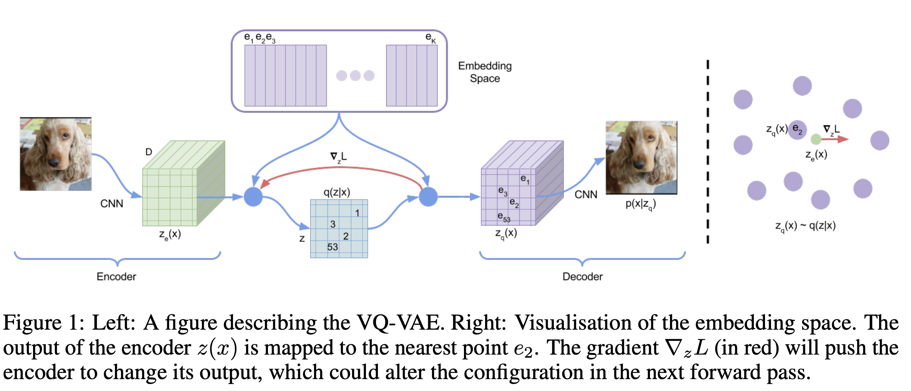
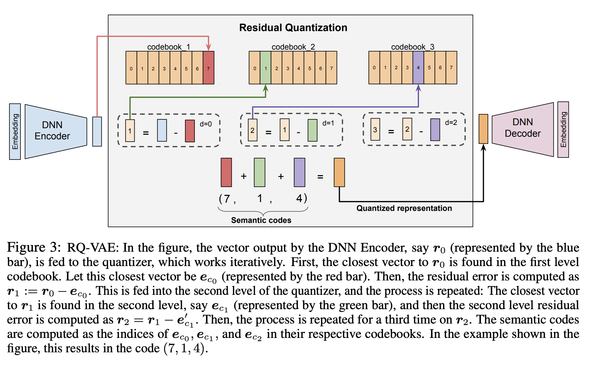

核心：直接对序列中**物品与物品**之间的**动态依赖关系**进行建模，关注“用户接下来会做什么”而非“用户是怎样的人”。

几个工作：

SASRec 直接将 Transformer 用到推荐序列预测上，奠定 "**预测下一个物品 ID**" 的范式。

后续两个方向：

- 深入对 **输入** 的理解： HTSU 把用户属性、行为类型、时间融合成一个复杂的 “事件流” 作为输入
- 改进**物品表示方法**：RQ-VAE 通过 "语义ID" 表示物品，更有意义地捕捉物品间的关系

## SASRec

## VQ-VAE

普通的 VAE 会将输入映射成一个 **连续的正态分布**，而 VQ-VAE 则是将输入映射成 **离散的分布(Codebook)**。 

解决的问题：原始 VAE 存在 **后验坍塌** 的问题（KL Vanishing），就是Decoder 太强，导致 Encoder 学不到有意义的表示（Latent Space 是无效的），VQ-VAE 通过离散化的方式避免了这个问题。

就是VQ-VAE 会让 Encoder输出的向量去 codebook 里去找最近的向量作为离散表示，然后再传给 Decoder。

反向传播时候的 reparameterization trick 是通过 **Straight-Through Estimator** 实现的，就是直接把梯度从 Decoder 传回 Encoder，忽略了离散化的过程。

这个Code Book也是训练得到的，两种loss方式：

- 基于损失函数的更新

$$
L = \underbrace{\|x - D(e_k)\|^2}_{\text{重建损失}} + \underbrace{\|sg[z_e(x)] - e_k\|^2}_{\text{Codebook 损失}} + \beta \underbrace{\|z_e(x) - sg[e_k]\|^2}_{\text{承诺损失}}
$$

这种方法的 1st term就是 重建loss: 让decoder 学会用选中的 codebook vector $e_k$ 来重建输入。

2nd term 是 codebook loss: 让 codebook vector $e_k$ 靠近 encoder 输出的向量 $z_e(x)$。这里的 $sg$ 是 stop-gradient 操作，表示在反向传播时不更新 $z_e(x)$（也就是直接固定住这个值）

3rd term 是承诺损失: 让 encoder 的输出 $z_e(x)$ 靠近选中的 codebook vector $e_k$，防止 encoder 输出过大。

- 基于 EMA 的更新

(Exponential Moving Average)

为什么要用 EMA？因为梯度下降更新 Codebook 比较慢且不稳定。

EMA 的逻辑就像是 **“投票”**：

- - 记录： 在一个 Batch 的训练中，记录下 Codebook 中每个向量 $e_k$ 被选中了多少次。
- - 平均： 把所有选中 $e_k$ 的那些 Encoder 输出向量 $z_e(x)$ 加起来求个平均。滑动更新： 

- $$e_k = \lambda e_k + (1-\lambda) (\text{本轮选中的平均值})$$
 
 
这就像是一个平滑的进化过程：如果很多图片（Encoder 输出）都觉得 $e_k$ 这个积木最合适，那 $e_k$ 就慢慢向这些图片的平均特征靠拢。

本质上其实不再是 VAE，而是一个 **离散的自编码器**，通过学习一个离散的表示空间（codebook）来捕捉输入数据的结构。因为他用来训练的一开始的分布是一个均匀分布，KL散度一项是个常数，没有贴近先验分布的过程，所以最后用的时候拿PixelCNN来建模先验分布，之后经过codebook采样出离散表示，再通过decoder重建输入。

## RQ-VAE

VQ-VAE 的序列长度较长，需要大量的codebook，会导致 codebook collapse: 

- codebook 太小，图像重建比较模糊，导致细节丢失
- codebook 很大，大部分向量没有训练到，导致 坍缩

解决方案：使用多级Codebook 设置有 $D$层的CodeBook，下一级的CodeBook去找上一级差的相似向量，最后达到一个很精细的表示。

损失函数和 VQ VAE类似，不过

分： 

$$
\mathcal{L} = \mathcal{L}_{recon} + \beta \mathcal{L}_{commit}
$$

重构损失（Reconstruction Loss）： 

$$
\mathcal{L}_{recon} = \|x - \hat{x}\|^2
$$

这个损失度量的是输入 和重构结果之间的欧氏距离，用于确保重构后的样本尽可能接近原始输入。这里同样会采用 Straight-Through Estimator。

承诺损失（Commitment Loss）： 

$$
\mathcal{L}_{commit} = \sum_{l=1}^{D} \|sg[z_e^{(l)}(x)] - e_{k}^{(l)}\|^2
$$

（sg[·] 是 stop-gradient 操作符，用于在反向传播时阻止梯度的传递），

推荐中：根据物品的内容特征 给每个物品构建一个语义ID

类似于AE，推理的时候还是只用Encoder，只要把物体的内容特征输入进去，就能得到对应的语义ID组，每个codebook输出一个值，最终拼接成一个语义ID。完全相同的后面再添加一个数。

## HSTU

## PinRec

PinRec 不仅仅根据用户历史预测下一个物品，还允许在生成时加入目标动作作为条件 。

在模型输出层，除了输入 Transformer 的隐藏状态，还加入了“期望结果”（如：用户点击、转存等）的嵌入向量 。

考虑到社交媒体用户在信息流中的交互顺序并不严格（用户可能先看下面的图再回来看上面的），PinRec 提出了在一个时间窗口 $\Delta$ 内预测多个潜在交互目标 

离线提升： 相比基准模型，PinRec 在首页信息流的召回率提升了 10% 以上，在搜索场景下甚至提升了 30% 。

在线价值： 在 Pinterest 的实测中，PinRec 显著增加了完成会话（Fulfilled Sessions）的数量和用户的留存时间（Time Spent）

## Recommendation System 的评价指标

### 召回率 Recall@k

Def: 用户真正感兴趣的所有物品中，被推荐系统成功推荐出来的比例

- Recall@5/Recall@10: 推荐系统推荐的前 5/10 个物品中，用户实际点击/喜欢的物品占所有推荐物品的比例
- Recall 越高，说明推荐系统越能满足用户的兴趣和需求

### 归一化 折损累计增益NDCG@k

衡量 **排序** 的得分：

- 用户喜欢/点击，就有分
- 推荐的位置越靠后，分数被除以一个越大的数（对数折损）
- 归一化：将分数缩放到 0 和 1 之间

$G_u$ 表示 对 user $u$ 来说的 ground-truth target items set，$\hat{y}_{u, 1}, \ldots \hat{y}_{u,K}$ 是 一个model 从 candidate set 中推荐的 top-K items。

根据 item $i$ 相关的 action type 定义一个 relevance function $w(i)$:

$$
w(i) = \begin{cases} 0, & \text{ if } i \text{ is an exposure only}  \\ 1, & \text{ if } i \text{ is clicked or liked} \\
\alpha, & \text{ if } i \text{ is a conversion}   \end{cases}
$$

$$
HitRate@K(u) = \frac{\sum_{k=1}^{K}w(\hat{y}_{u,k}) \mathbb{I} \{ \hat{y}_{u,k} \in G_u\}}{\sum_{i \in G_u} w(i)}
$$

然后加权的 $DCG@K$ 定义为：

$$
DCG@K(u) = \sum_{k=1}^{K}\frac{w(\hat{y}_{u,k}) \mathbb{I} \{ \hat{y}_{u,k} \in G_u\}}{\log_2(k+1)}
$$

把 $G(u)$ 按照 $w(i)$进行降序排列，理想的 $IDCG@K(u)$ 定义为：

$$
IDCG@K(u) = \sum_{k=1}^{\min(K, |G_u|)}\frac{w(i_k^{*})}{\log_2(k+1)}
$$

这里，$i_1^{*}, i_2^{*}, \ldots$ 是按照 $w(i)$ 降序排列的 $G(u)$ 中的物品的ideal ordering。最后加权的 NDCG@K 是：

$$
NDCG@K(u) = \frac{DCG@K(u)}{IDCG@K(u)}
$$

 