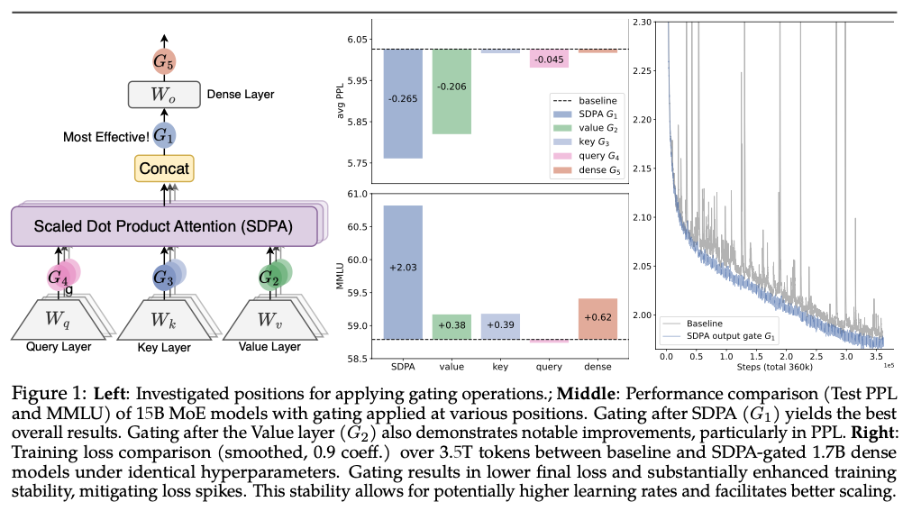

arXiv: 2505.06708

Scaled Dot-Product Attention (SDPA)：标准的Transformer Attention

# Motivation & Problems

Problems:

- Gating 机制很常用，比如LSTM, GRUs 探索用gating去控制information flow across time steps;或者现在的State-space models 和一些 attention机制也都会用 gating，但是现有的工作 rarely examines the specific effects of '**gating**'
    - 'gating' 机制除了Routing还有什么用，举了两个例子：Switch Heads和NSA
    - 

# Methods

使用一个  **head-specific sigmoid gate** after the Scaled Dot-Product Attention (SDPA)—consistently improves performance

在不同的地方加gating: 发现G1(head-specific) 的最有效，PPL减少0.2，MMLU性能提升2，同时训练的Spike会减少(stability 增加)—右图

把有效性归结为两个因素：

- **Non-Linearity**: Introducing non-linearity upon the low-rank mapping in the softmax attention
- **Sparsity**: Applying **query-dependent sparse gating scores** to modulate the SDPA output.
    - sparse gating还会减少 attention sink现象：开始的tokens 不成比例地 dominate attention scores

**基础：原始的Transformer：**

QKV 投影：

Input $X \in \mathbb{R}^{n \times d_{model}}$ 通过 $W_{Q}, W_{K}, W_{V} \in \mathbb{R}^{d_{model}\times d_{k}}$ 投影得到 $Q, K, V \in \mathbb{R}^{n \times d_k}$：

$$
Q = XW_{Q}, K = XW_{K}, V = XW_{V}
$$

算一下 SDPA：

$$
\text{Attention}(Q, K, V) = \text{softmax}\left(\frac{QK^T}{\sqrt{d_k}}\right)V
$$

Multi-Head Concatenation：设有 $h$ 个 heads，每个 head 的投影矩阵为 $W_{Q}^{i}, W_{K}^{i}, W_{V}^{i} \in \mathbb{R}^{d_{model}\times d_{k}}$，则所有的输出拼接起来：

$$
\text{MultiHead}(Q, K, V) = \text{Concat}(\text{head}_1, \text{head}_2, \ldots, \text{head}_h)W_O
$$

where $\text{head}_i = \text{Attention}(QW_{Q}^{i}, KW_{K}^{i}, VW_{V}^{i})$.

<!-- [查看项目]() -->

最终的输出：通过 $W_{O} \in \mathbb{R}^{hd_{k}\times d_{model}}$ 投影回去：

$$
O = \text{MultiHead}(Q, K, V)W_{O}
$$