# 核心问题：

- Long-Term Semantic(语义记忆，事实概念)/Procedural Memory（技能，习惯，程序的记忆：骑自行车，演奏乐器）和reason的交互模式除了retrieval-based还能怎么样？如何设计？

- 从 working/semantic -> procedure的self evolve过程：需要Agent learn from experience and practice, 不能单纯靠retrieval。Agents在长期对话场景中需要动态，个性化地更新用户偏好记忆（风格变化）

- 外部的知识和内部的Memory应该如何结合？更细化的说法
  - 每一步 LLM 外部知识和内部参数的加权融合：
    - 已有工作：Memory Decoder 直接相加（输出层的插值融合），各种RAG，把回来的文本显示拼接到输入
    - 想法：更细粒度的门控机制，直接控制内部的信息流
    - 假设在RAG的QA数据集上进行，输入(已有的)：
      - 当前上下文 $x$,
      - 外部知识库召回的top-k段落 $D = {d_1, d_2, ..., d_k}$
      - 当前LLM 的hidden state $h$ 
      - LLM 的 最后一层输出 logits $l$
    - 输出：
      - 最终结果
    - 参数：PPL，EM, F1
    - 可能的方法：参考 gated Attention，用一个 [0,1] 的数去乘内部的hidden states表示，但是我们不能用[0,1] 之间的数去乘
      - 考虑用hidden states 和 external的文本做一个 cross attention，把 external文本做一个加权得到一个向量（小矩阵），
      - $E_{aligned} = \text{softmax}(\frac{H_{attn}M^{\top}}{\sqrt{d}})M$
      - 引入 门控向量和一个新的learnable matrix $W_{gate}$: $g = \sigma(E_{aligned}W_{gate})$
      - $H_{final} = H_{attn} \odot g + E_{aligned} \odot (1 - g)$
    - 潜在问题：
      - 粒度的对齐问题，选择hidden state 的层级问题
        - 看一下 CAG(KV cache augmented generation) 用KV Cache做RAG
       
  - Knowledge Conflict:(没有具体调研)

另一种解法（改变 Gated方式，粒度对齐用重采样层，插入位置使用IKS分数）：

我们将该框架命名为 GLMI (Gated Latent Memory Injector)。

模块一：粒度对齐器 (The Latent Resampler)

为了解决 $N$ 个文本Token与 $1$ 个隐状态的对齐问题，必须引入一个重采样层。我们推荐采用 Perceiver Resampler 6 的变体。

输入：

- 检索到的Top-k段落 $D$，经过编码器（如Frozen BERT或LLM的前几层）得到嵌入矩阵 $E_D \in \mathbb{R}^{N_{total} \times d}$。
  - 这里 $N_{total}$ 是所有段落Token的总和，可能非常大（如4096）。
  - 参数：潜在查询 (Latent Queries) $Q_{lat}$： 一组随机初始化并可学习的向量，数量固定为 $K$（例如 $K=32$ 或 $64$）。这个 $K$ 就是我们定义的“对齐后的粒度”。
  - 计算过程：交叉注意力压缩： 使用 $Q_{lat}$ 去“查询”外部文档 $E_D$。
  $$
    M_{mem} = \text{Softmax}\left( \frac{Q_{lat} (E_D W_k)^T}{\sqrt{d}} \right) (E_D W_v) + Q_{lat}
  $$
  这里，注意力的Key和Value来自于外部文档，Query来自于可学习的Latent Queries。
  
  前馈处理：
  
  $$
  M_{mem} = \text{FFN}(\text{LayerNorm}(M_{mem}))
  $$
  
输出：$M_{mem} \in \mathbb{R}^{K \times d}$。意义： 无论外部检索了多少文档，经过这个模块后，都被压缩成了固定数量 $K$ 的高维向量。这 $K$ 个向量代表了文档中对当前任务最关键的“知识摘要”。这完美解决了用户的“形式”和“粒度”顾虑。4.2 模块二：细粒度门控注入 (Fine-grained Gated Injection)有了对齐后的 $M_{mem}$，我们就可以在LLM的中间层执行安全的融合。输入：当前层LLM的隐状态 $h_t \in \mathbb{R}^{1 \times d}$（Query）。对齐后的记忆 $M_{mem}$（Key, Value）。计算过程：知识查询 (Knowledge Querying)： LLM“询问”记忆模块。$$c_t = \text{MultiHeadAttn}(Q=h_t W_q', K=M_{mem} W_k', V=M_{mem} W_v')$$注意：这里使用的是专门为融合层训练的 $W'$ 参数，而不是LLM原本的参数。零初始化门控 (Zero-init Gating)：计算标量或向量门控值 $\alpha$。为了保证训练稳定性，必须使用 tanh 且初始化为0。$$\alpha = \tanh(h_t W_{gate})$$初始化时 $W_{gate} \approx 0 \implies \alpha \approx 0$。残差更新 (Residual Update)：$$h_{final} = h_t + \alpha \cdot c_t$$对比用户的原始方案：用户：$h \odot g + c \odot (1-g)$GLMI：$h + \tanh(g) \cdot c$GLMI方案保留了主干流（Identity Path），使得梯度可以无损传播，同时允许模型逐渐学习如何“开启”外部知识的闸门。4.3 模块三：动态层选择 (Dynamic Layer Selection)不建议在每一层都进行注入，这会带来巨大的计算开销并干扰模型。建议结合LFD的思路：预计算IKS： 在推理阶段，实时监控每一层的 $h_t$ 进入FFN前后的变化。$$\text{Score}_l = \text{KL\_Divergence}(\text{Logit}(h_{in}), \text{Logit}(h_{out}))$$动态路由： 设定阈值 $\tau$。如果 $\text{Score}_l > \tau$（高IKS）：说明模型正在强烈调用内部记忆（如回忆“巴黎的首都”），此时跳过注入，避免冲突。如果 $\text{Score}_l < \tau$（低IKS）：说明模型处于推理或传递状态，激活GLMI模块，注入外部证据

# GatedAttention-2505.06708

## Motivation & Problems

Problems:

- Gating 机制很常用，比如LSTM, GRUs 探索用gating去控制information flow across time steps;或者现在的State-space models 和一些 attention机制也都会用 gating，但是现有的工作 rarely examines the specific effects of '**gating**'
    - 'gating' 机制除了Routing还有什么用，举了两个例子：Switch Heads和NSA
    - 

## Methods

使用一个  **head-specific sigmoid gate** after the Scaled Dot-Product Attention (SDPA)—consistently improves performance

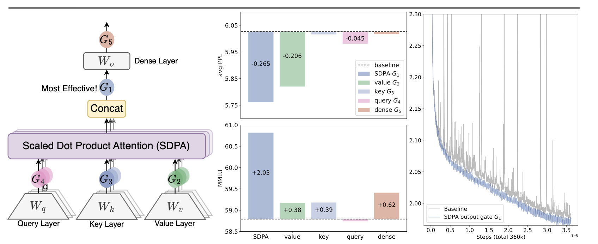

在不同的地方加gating: 发现G1(head-specific) 的最有效，PPL减少0.2，MMLU性能提升2，同时训练的Spike会减少(stability 增加)—右图

把有效性归结为两个因素：

- **Non-Linearity**: Introducing non-linearity upon the low-rank mapping in the softmax attention
- **Sparsity**: Applying **query-dependent sparse gating scores** to modulate the SDPA output.
    - sparse gating还会减少 attention sink现象：开始的tokens 不成比例地 dominate attention scores

**基础：原始的Transformer：**

QKV 投影：

Input $X \in \mathbb{R}^{n \times d_{model}}$ 通过 $W_{Q}, W_{K}, W_{V} \in \mathbb{R}^{d_{model}\times d_{k}}$ 投影得到 $Q, K, V \in \mathbb{R}^{n \times d_k}$：

$$
Q = XW_{Q}, K = XW_{K}, V = XW_{V}
$$

算一下 SDPA：

$$
\text{Attention}(Q, K, V) = \text{softmax}\left(\frac{QK^T}{\sqrt{d_k}}\right)V
$$

Multi-Head Concatenation：设有 $h$ 个 heads，每个 head 的投影矩阵为 $W_{Q}^{i}, W_{K}^{i}, W_{V}^{i} \in \mathbb{R}^{d_{model}\times d_{k}}$，则所有的输出拼接起来：

$$
\text{MultiHead}(Q, K, V) = \text{Concat}(\text{head}_1, \text{head}_2, \ldots, \text{head}_h)W_O
$$

where $\text{head}_i = \text{Attention}(QW_{Q}^{i}, KW_{K}^{i}, VW_{V}^{i})$.

<!-- [查看项目]() -->

最终的输出：通过 $W_{O} \in \mathbb{R}^{hd_{k}\times d_{model}}$ 投影回去：

$$
O = \text{MultiHead}(Q, K, V)W_{O}
$$

**Gating 机制：**

$$
Y' = g(Y, X, W_{\theta}, \sigma) = Y \odot \sigma(X W_{\theta})
$$

$Y$ 是要改的input，$X$ 用的是 hidden states after pre-norm， $W_{\theta}$ 是 learnable parameters, $\sigma$ 是 sigmoid function。

测了多种 gating:

- 不同的位置：QKV投影之后
- 不同的粒度：headwise和elementwise
- Head specific(每个头不一样) vs shared（头共享）
- 乘或者加

# Cache2cache-2510.03215

ICLR 26 得分：8 6 4 4

## 解决问题 & Motivation

现有的 Multi-LLM systems 使用 text (output token sequences) 进行交互，会lose semantic information 和 token-token generation latency。

提出的解决方案：Enrich KV-cache semantics，用一个NN project and fuse source model的KV-cache 和 target model的KV-cache

# 做法 & Methods

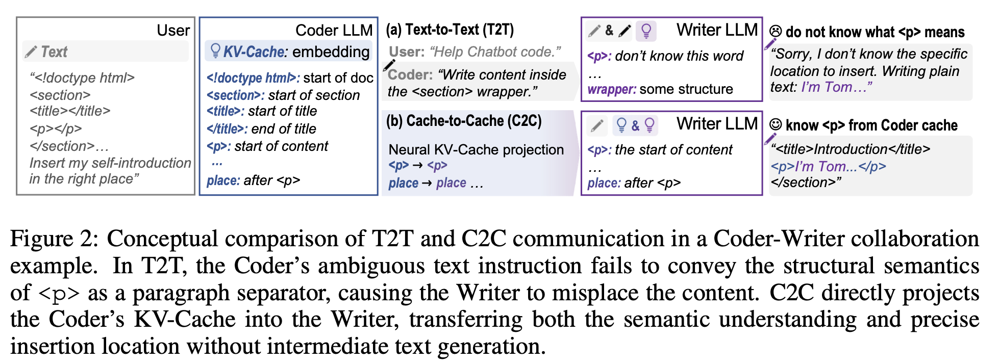

现有Text2text的问题：convey rich or diverse semantic interpretations of shared texts时会restrict information

先做**预实验**看KV cache能不能share：

- Cache Enrichment Oracle:
    - 不增加 cache size时 fixed-length question的KV-cache 的semantic quality  是否improve（验证 KV Cache 的质量提升也可以提高生成质量）
    - 验证方法：

      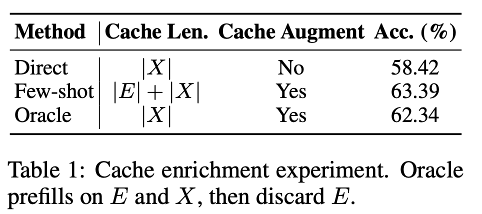
    
    Direct 直接输入问题；Few-shot包括输入的一些问题，Cache的长度也会增加；Oracle是prefill的时候先用few-shot examples和Questions进去计算KV Cache，然后decode的时候把KV cache剪一下，只剩 Question的长度
    
    之后看最后的效果
    
    - 对不同层也做了验证(?)
    
    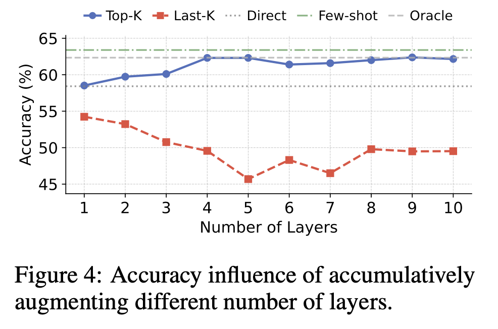
    

- Cache Transformation Oracle:
    - 看一个模型生成的KV cache另一个模型能不能用
    - 训一个三层MLP 强行对齐Qwen3-4B(Source) 和 Qwen3-0.6B(Target) 的KV cache，在MMLU-Redux上(Datasets格式 和 Loss 不太清楚)训练
    - 之后把KV-Cache用 t-SNE降维发现可以对齐

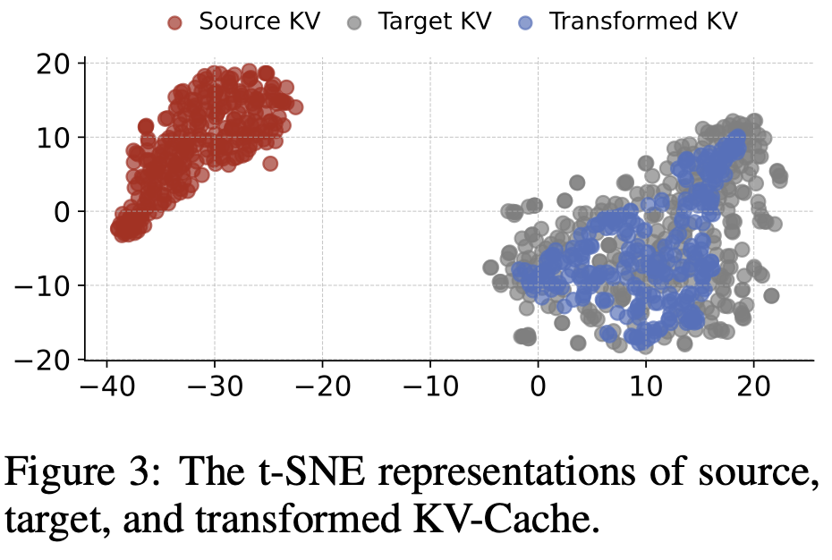

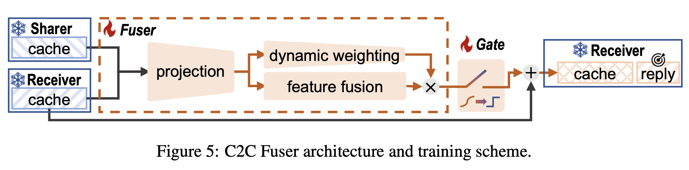

之后设计这个架构：

- Projection: 拼接 Receiver和Sharer的KV-Cache
- Dynamic Weighting: 用input-aware head reweight projected information
- Learnable gate: 什么时候 inject Sharer’s context

有点抽象

# 总结

和KD的区别：KD reason的时候只需要 被distill的那个模型，但是这个C2C好像需要两个一起跑，然后实时注入KV Cache，测试数据集感觉有点抽象（单跳或单模型就可以解决）

这个场景挺有意思，但是好像没体现出来“Multi-Agents”

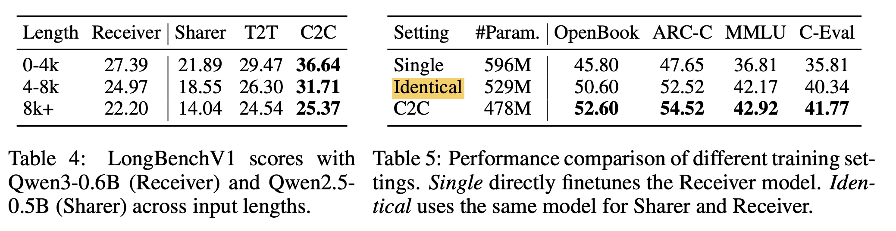

Sharer 和 Receiver 一样的时候也会有提升

# C3-2511.15244

## 解决问题 & Motivations

超长文本输入进去会给LLM带来计算和内存 challenges(解决长文本的文本压缩问题)

Deepseek-OCR: 

Text → TextTokens → LLM to Text → Image → Visual Latent Tokens → LLM

取消了 text → Image的步骤，挑两个LLM，第一个压缩文本成textual latent tokens, 第二个再解码出来。

# 和已有 Work 的区别

主要区别在于ICAE的压缩performance太差，C3 用encoder LLM 直接distill text information 到一个定长的 non-interpretable latent tokens。

还有做Visual token压缩text tokens的（Deepseek OCR, Glyph）

## 做法 & Methods

和ICAE非常类似

也是分块压的

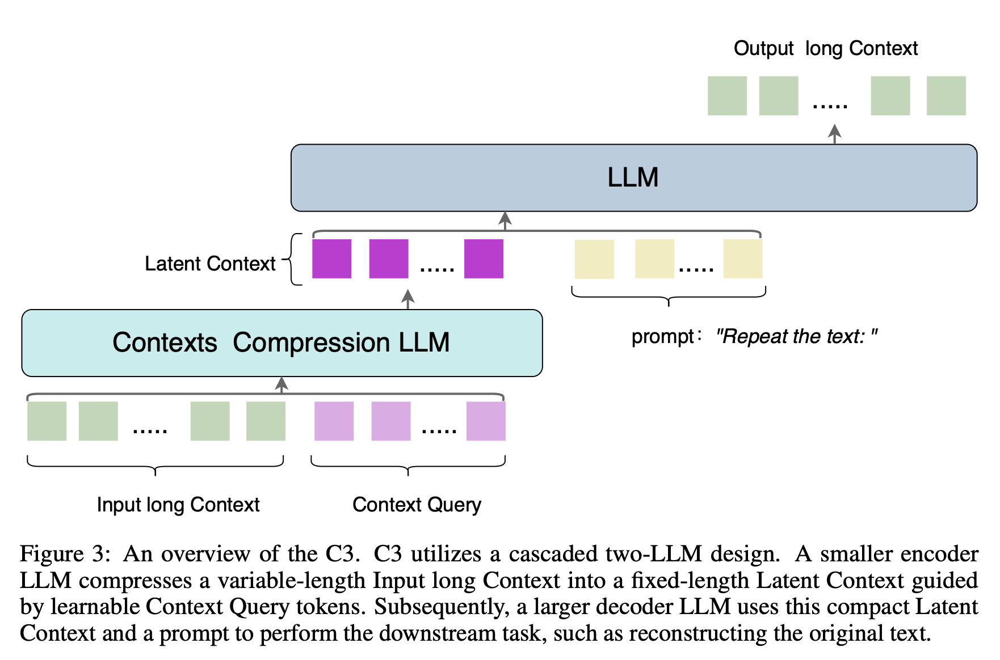

## 实验效果

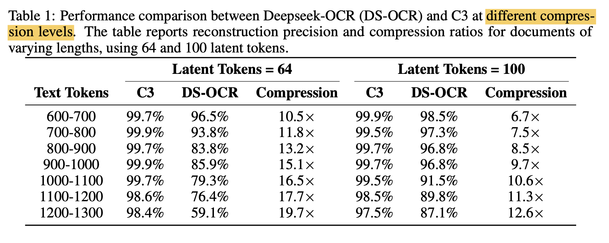

没有用ICAE和其他Compress的方法做Baseline，很难判断说的情况

感觉很奇怪，定长强压，然后64个tokens好于100 tokens的情况。

数据也用的很奇怪，用的OCR的Fox数据集：

输入是多文档图片输入，输出是回答？

C3 输入是先转成文字？

## 总结

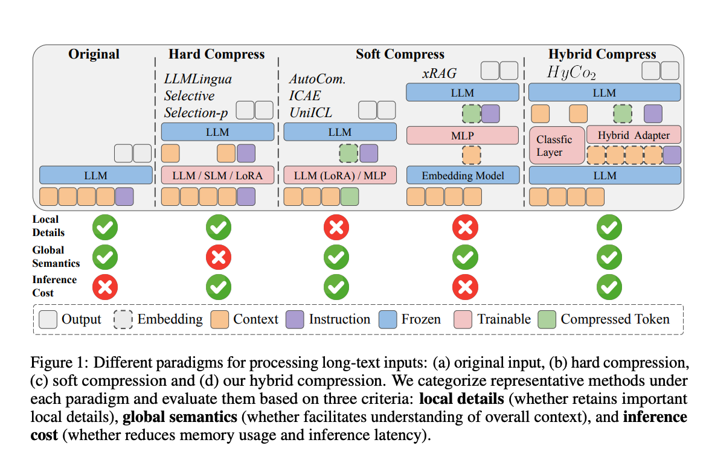

跟这些的区别是什么，2505.15774

# EvoMemory-2511.20857

# GAM-2511.18423

## 解决的问题

现有 AI Agents 在 Offline的时候一次性压缩全部history，会导致信息损失，无法响应细粒度需求。

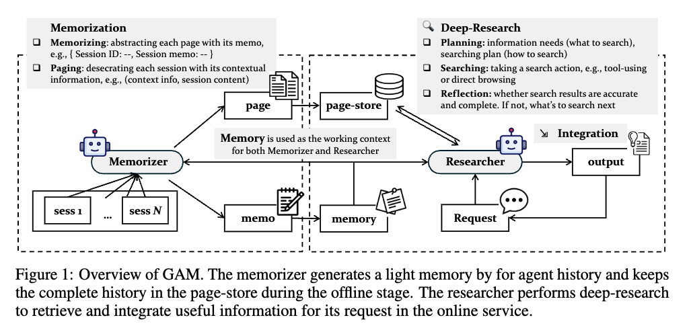

## 方法

- 用“运行时即时编译”替代“提前编译”：

  离线阶段仅保留轻量但高信号的记忆摘要，完整历史以原始页面形式存入可检索库；在线阶段按需执行“深度研究”，动态整合精确上下文，实现近乎无损的记忆服务。

- 将“记忆”重新定义为“最小体积、最大任务效用”的优化问题

两个模块 Memorizer和 Researcher：

Memorizer 生成摘要并更新轻量记忆，同时存储完整历史到检索库

Researcher 做深度在线工作：规划检索整合反思

强化学习增强摘要质量和检索策略。

# KAVA-2510.02312

# CLaRa-2511.18659

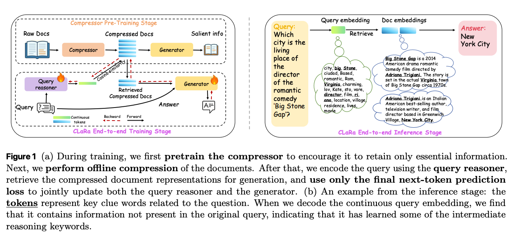

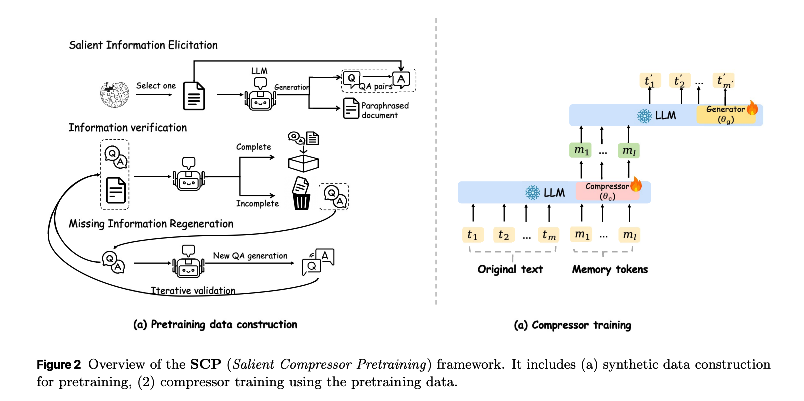

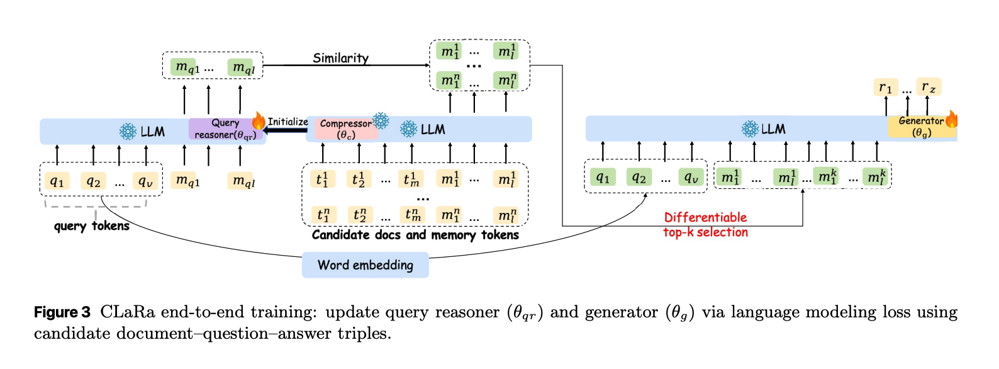

# CoLaR-2505.16552

Nips25

## 解决的问题

Generating lengthy reasoning
chains are **computational costly**, impeding efficiency and scalability. 

## 方法

和现有方法的区别：
- 一类是基于token level的压缩：识别并跳过less informative tokens
- 另一类是dense latent space的reason
  - 通过KD 或者 CL 直接把推理知识嵌入模型
  - 动态跳过或者重复Transformer层的计算减少计算成本、
  - 自回归用latent representations 替代token-level，但是主要都是 **fixed length**

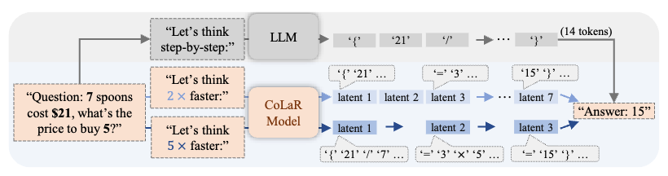

提出这个CoLaR 框架：

- 可以 auto-regressively 预测 latent variables 包含前几个tokens的 semantics，同时可以有dynamic的speed
- 用一个probabilistic Latent Head设计，证明了reinforcement learning在latent reason上的有效性

听上去和 Activation Beacon很像

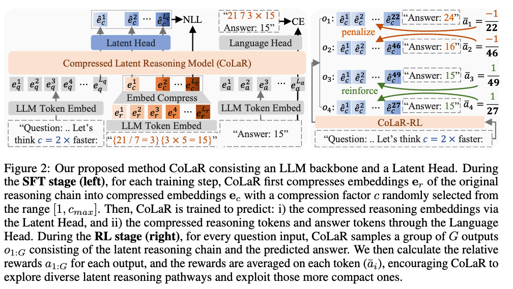

训练过程：

- SFT: 通过一个辅助的“下一个压缩嵌入预测”目标来扩展传统的下一个标记预测任务。具体而言，CoLaR 随机采样一个压缩因子 $c$，并使用一个“Embedding Compress”模块将连续的 $c$ 个标记的嵌入合并成一个压缩嵌入。然后，训练一个专门的“Latent Head”来预测后续压缩嵌入的分布。这一过程不仅使模型能够理解这些压缩的潜在表示，还训练模型在给定压缩嵌入的情况下预测压缩的推理标记和答案标记。
- RL: CoLaR 进一步通过强化学习来增强模型的推理能力。利用“Latent Head”的非确定性特性，CoLaR 能够探索多样化的推理路径，并利用更紧凑的路径。具体来说，CoLaR 使用 Group Relative Policy Optimization (GRPO) 算法，通过采样一组不同的输出，计算每个输出的相对奖励，并根据这些奖励来更新模型的策略。这种方法鼓励 CoLaR 在探索多样化的推理路径的同时，利用那些更短的路径，从而提高推理效率。

与以往的确定性潜在推理方法不同，CoLaR 的“Latent Head”输出的是一个概率分布，而不是确定性的值。这种概率性表示允许模型在推理过程中产生多样化的推理路径，从而在强化学习的框架下，更好地探索和利用不同的推理策略。这种方法不仅提高了模型的推理性能，还显著减少了推理链的长度。

这个SFT的概率分布，数据类型没太看明白其实。

# GSW-2511.07587

## 解决的问题

长上下文推理的时候：

- 长文本超过LLM 上下文窗口。
- 现有的retrieve方法，用知识图谱，但是更多在事实知识上的评估，不好建模real world中space time变化的过程。

提出 GSW: 可插拔生成式记忆框架：文本流 -> 以角色为中心，带时空约束的语义图，之后持续更新。

## 方法

Operator + Reconciler 机制：

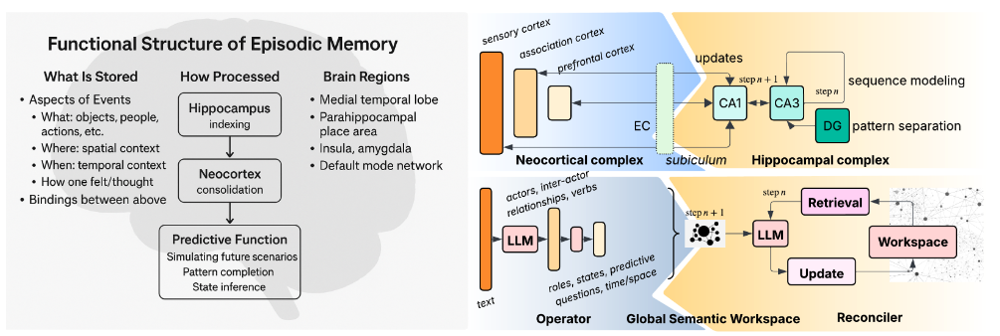

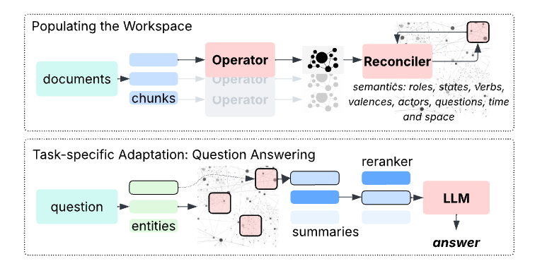

- Operator：把文本块解析成“局部语义图”
  - 输入：文本流
  - 对每段分 chunk，用LLM（GPT-40, t=0）一次完成：
    - Actor 抽取: 人/组织/地点/时间/物品/抽象概念全部编号，跨块可合井。
    - Role & State 标注: 用自然语言短语（非预定义本体）给每个 actor 打上”角色”与“状态”标签，并附带概率含义: $\pi_{r} (a_i \rightarrow a_j) \in [0,1]$，状态 $s$ 进一步条件化该分布：$\pi_{r,s} (a_i \rightarrow a_j) = \pi_{r}(a_i \rightarrow a_j|s)$
    - Verb/Valence 解析: 识别**事件动词**及其价态，输出“谁对谁做了什么”并预测可能导致的角色/状态迁移
    - 时空耦合: 显式抽取或推断“同一时刻/同一地点”的实体集合，为后续一致性校验提供硬约束：$\| X_n(a_i) - X_n(a_j) \| \le \delta_{v}, T_{n+1} - T_n \sim \Delta_{v}$
    - Forward-falling Questions: 为下游推理预生成“接下来可能问什么”（何时起诉、在哪审判等），供 Reconciler 回填。
  - 输出: 中间语义结构 $W_n$（JSON 化局部图）。
- Reconciler: 增量合并成 "全局工作区"
  - 用Markov假设和图合并算法，合并实体，写事件/状态时间到历史链
  - 最后得到全局语义图 $M_n$

- 最后 Query的时候：先实体摘要，之后重排，最后top-k 摘要传给 LLM生成答案

在EPBench上评测，优于HippoRAG2, LightRAG等。

# REFRAG-2509.01092

## 解决问题

RAG场景下 Long Context 导致latency 和存储太大; 同时 RAG retrieve回来的片段往往冗余度高，影响生成质量。

## 方法

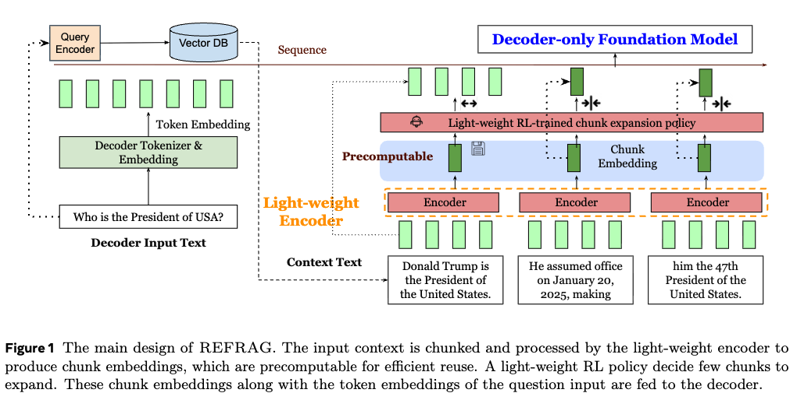

把retrieve回来的 context 切块，之后用小encoder model把chunks encode成embeddings，这些embeddings用一个 projection layer $\phi$ 投影去 match decoder model的token embedding size

之后这些embedding和question的token embeddings 一起传给decoder生成答案

在实际操作中，还用RL训练一个 policy network 让模型可以expand important chunks，压缩不重要的chunks

## 实验

PPL有显著下降：

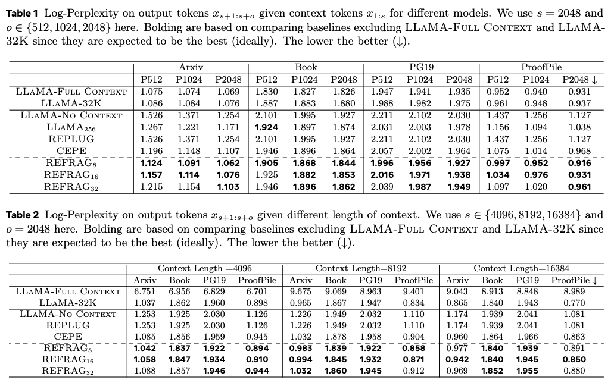

